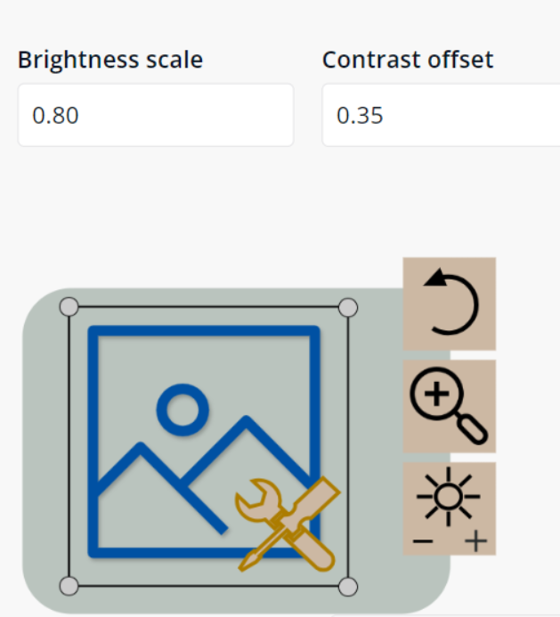
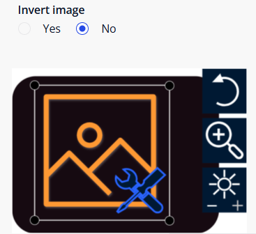
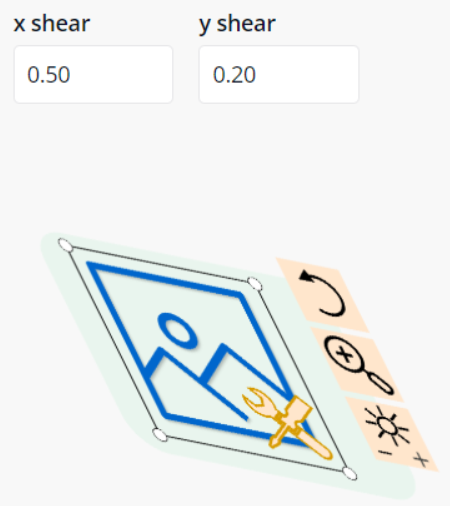

# ImageModifierToolbox - Version 1.4
This Mendix module contains multiple Java actions that can be used to modify images.

All actions currently work with jpg, jpeg, and png images.
## Java Actions

- **ImageBlur**: Blurs an image. Blur scale 0 is no blur and 1 is maximum blur.

- **ImageBrightnessAndContrast**: Modifies the brightness and/or contrast of input image. With contrast offset, -100 is very high contrast and 100 is very low contrast.

  

- **ImageChangeColour**: Change an imgae to grayscale or add a coloured tint.

- **ImageCompress**: Compresses images from a scale between "high compression is important" and "high quality is important"

- **ImageConvertToPNG**: Converts Jpg, Jpeg, and WEBP images to PNG. Userful when wanting to use Java actions that require image to be in the PNG format.

- **ImageFlip**: Flips images horizontally and/or vertically

- **ImageInvertColour**: Inverts the colour of an image

  

- **ImageOpacity**: Modifies the opacity of input image. Default value is 1. Value should be between 0 and 1.

- **ImageRotate**: Rotates image clockwise/anticlockwise.

- **ImageScale**: Scales the input image horizontally and vertically. Default scale values are 1 (no scale). 
Values between 0 and 1 will decrease scale. Values greater than 1 will increase scale.

- **ImageShear**: Shears input image horizontally and/or vertically. Default shear values are 0 (no shear).
values can be positive or negative

  

